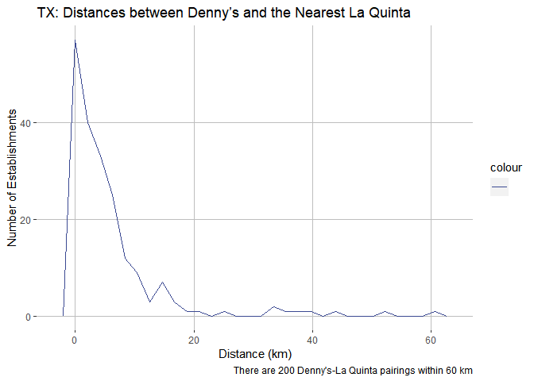
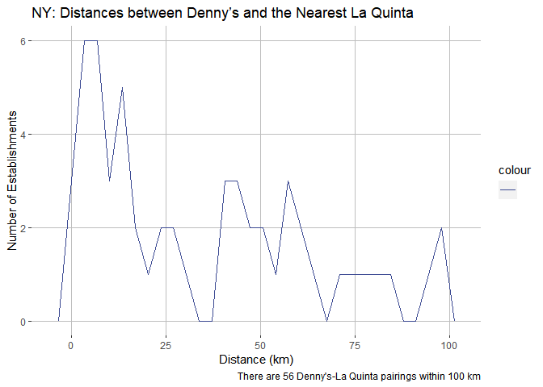

Lab 04 - La Quinta is Spanish for next to Denny’s, Pt. 2
================
Colin Li
02/07/2023

### Load packages and data

``` r
library(tidyverse) 
library(dsbox) 
```

``` r
states <- read_csv("data/states.csv")
```

### Exercise 1

``` r
dn_ak <- dennys %>%
  filter(state == "AK")
nrow(dn_ak)
```

    ## [1] 3

How many Denny’s locations are there in Alaska? 3 locations

### Exercise 2

``` r
lq_ak <- laquinta %>%
  filter(state == "AK")
nrow(lq_ak)
```

    ## [1] 2

How many La Quinta locations are there in Alaska?

2 locations

### Exercise 3

``` r
dn_lq_ak <- full_join(dn_ak, lq_ak, by = "state")
dn_lq_ak
```

    ## # A tibble: 6 × 11
    ##   address.x      city.x state zip.x longi…¹ latit…² addre…³ city.y zip.y longi…⁴
    ##   <chr>          <chr>  <chr> <chr>   <dbl>   <dbl> <chr>   <chr>  <chr>   <dbl>
    ## 1 2900 Denali    Ancho… AK    99503   -150.    61.2 3501 M… "\nAn… 99503   -150.
    ## 2 2900 Denali    Ancho… AK    99503   -150.    61.2 4920 D… "\nFa… 99709   -148.
    ## 3 3850 Debarr R… Ancho… AK    99508   -150.    61.2 3501 M… "\nAn… 99503   -150.
    ## 4 3850 Debarr R… Ancho… AK    99508   -150.    61.2 4920 D… "\nFa… 99709   -148.
    ## 5 1929 Airport … Fairb… AK    99701   -148.    64.8 3501 M… "\nAn… 99503   -150.
    ## 6 1929 Airport … Fairb… AK    99701   -148.    64.8 4920 D… "\nFa… 99709   -148.
    ## # … with 1 more variable: latitude.y <dbl>, and abbreviated variable names
    ## #   ¹​longitude.x, ²​latitude.x, ³​address.y, ⁴​longitude.y

…

### Exercise 4

``` r
glimpse(dn_lq_ak)
```

    ## Rows: 6
    ## Columns: 11
    ## $ address.x   <chr> "2900 Denali", "2900 Denali", "3850 Debarr Road", "3850 De…
    ## $ city.x      <chr> "Anchorage", "Anchorage", "Anchorage", "Anchorage", "Fairb…
    ## $ state       <chr> "AK", "AK", "AK", "AK", "AK", "AK"
    ## $ zip.x       <chr> "99503", "99503", "99508", "99508", "99701", "99701"
    ## $ longitude.x <dbl> -149.8767, -149.8767, -149.8090, -149.8090, -147.7600, -14…
    ## $ latitude.x  <dbl> 61.1953, 61.1953, 61.2097, 61.2097, 64.8366, 64.8366
    ## $ address.y   <chr> "3501 Minnesota Dr.", "4920 Dale Rd", "3501 Minnesota Dr."…
    ## $ city.y      <chr> "\nAnchorage", "\nFairbanks", "\nAnchorage", "\nFairbanks"…
    ## $ zip.y       <chr> "99503", "99709", "99503", "99709", "99503", "99709"
    ## $ longitude.y <dbl> -149.9119, -147.8660, -149.9119, -147.8660, -149.9119, -14…
    ## $ latitude.y  <dbl> 61.18843, 64.82426, 61.18843, 64.82426, 61.18843, 64.82426

How many observations are in the joined dn_lq_ak data frame? What are
the names of the variables in this data frame.

6 observations, names are address.x, city.x, state, zip.x, longitude.x,
latitude.x, country.x, establishment.x, address.y, city.y, zip.y,
longitude.y, latitude.y, country.y, establishment.y

…

### Exercise 5

``` r
haversine <- function(long1, lat1, long2, lat2, round = 3) {
  # convert to radians
  long1 = long1 * pi / 180
  lat1  = lat1  * pi / 180
  long2 = long2 * pi / 180
  lat2  = lat2  * pi / 180
  
  R = 6371 # Earth mean radius in km
  
  a = sin((lat2 - lat1)/2)^2 + cos(lat1) * cos(lat2) * sin((long2 - long1)/2)^2
  d = R * 2 * asin(sqrt(a))
  
  return( round(d,round) ) # distance in km
}
```

…

### Exercise 6

``` r
dn_lq_ak <- dn_lq_ak %>%
  mutate(distance = haversine(long1 = longitude.x, lat1 = latitude.x, long2 = longitude.y, lat2 = latitude.y))
```

…

### Exercise 7

``` r
dn_lq_ak_mindist <- dn_lq_ak %>%
  dplyr::group_by(address.x) %>%
  dplyr::summarize(closest = min(distance))
```

### Exercise 8

``` r
library(ggsci)

ggplot(data = dn_lq_ak_mindist, 
       mapping = aes(x = closest, color = " ", show.legend = FALSE)) + scale_color_aaas() + geom_freqpoly() + scale_y_continuous(breaks = c(0, 1, 2)) + scale_x_continuous(breaks = c(0, 1, 2, 3, 4, 5, 6)) + xlab("Distance (km)") + ylab("Number of Establishments") + ggtitle("AK: Distances between Denny’s and the Nearest La Quinta") + labs(caption = "There are 3 Denny's-La Quinta pairings within 6 km") +
  theme(
  panel.background = element_rect(fill = NA),
  panel.grid.major = element_line(colour = "grey"),
) 
```

    ## `stat_bin()` using `bins = 30`. Pick better value with `binwidth`.

<!-- -->

``` r
summary(dn_lq_ak_mindist)
```

    ##   address.x            closest     
    ##  Length:3           Min.   :2.035  
    ##  Class :character   1st Qu.:3.616  
    ##  Mode  :character   Median :5.197  
    ##                     Mean   :4.410  
    ##                     3rd Qu.:5.598  
    ##                     Max.   :5.998

### Exercise 9

``` r
dn_nc <- dennys %>%
  filter(state == "NC")

lq_nc <- laquinta %>%
  filter(state == "NC")

dn_lq_nc <- full_join(dn_nc, lq_nc, by = "state")
dn_lq_nc
```

    ## # A tibble: 336 × 11
    ##    address.x     city.x state zip.x longi…¹ latit…² addre…³ city.y zip.y longi…⁴
    ##    <chr>         <chr>  <chr> <chr>   <dbl>   <dbl> <chr>   <chr>  <chr>   <dbl>
    ##  1 1 Regent Par… Ashev… NC    28806   -82.6    35.6 165 Hw… "\nBo… 28607   -81.7
    ##  2 1 Regent Par… Ashev… NC    28806   -82.6    35.6 3127 S… "\nCh… 28208   -80.9
    ##  3 1 Regent Par… Ashev… NC    28806   -82.6    35.6 4900 S… "\nCh… 28217   -80.9
    ##  4 1 Regent Par… Ashev… NC    28806   -82.6    35.6 4414 D… "\nDu… 27707   -79.0
    ##  5 1 Regent Par… Ashev… NC    28806   -82.6    35.6 1910 W… "\nDu… 27713   -78.9
    ##  6 1 Regent Par… Ashev… NC    28806   -82.6    35.6 1201 L… "\nGr… 27407   -79.9
    ##  7 1 Regent Par… Ashev… NC    28806   -82.6    35.6 1607 F… "\nCo… 28613   -81.3
    ##  8 1 Regent Par… Ashev… NC    28806   -82.6    35.6 191 Cr… "\nCa… 27518   -78.8
    ##  9 1 Regent Par… Ashev… NC    28806   -82.6    35.6 2211 S… "\nRa… 27612   -78.7
    ## 10 1 Regent Par… Ashev… NC    28806   -82.6    35.6 1001 A… "\nMo… 27560   -78.8
    ## # … with 326 more rows, 1 more variable: latitude.y <dbl>, and abbreviated
    ## #   variable names ¹​longitude.x, ²​latitude.x, ³​address.y, ⁴​longitude.y

``` r
dn_lq_nc <- dn_lq_nc %>%
  mutate(distance = haversine(long1 = longitude.x, lat1 = latitude.x, long2 = longitude.y, lat2 = latitude.y))

dn_lq_nc_mindist <- dn_lq_nc %>%
  dplyr::group_by(address.x) %>%
  dplyr::summarize(closest = min(distance))


ggplot(data = dn_lq_nc_mindist, 
       mapping = aes(x = closest, color = " ", show.legend = FALSE)) + scale_color_aaas() + geom_freqpoly() + xlab("Distance (km)") + ylab("Number of Establishments") + ggtitle("NC: Distances between Denny’s and the Nearest La Quinta") + labs(caption = "There are 28 Denny's-La Quinta pairings within 200 km") +
  theme(
  panel.background = element_rect(fill = NA),
  panel.grid.major = element_line(colour = "grey"),
) 
```

    ## `stat_bin()` using `bins = 30`. Pick better value with `binwidth`.

<!-- -->

``` r
summary(dn_lq_nc_mindist)
```

    ##   address.x            closest       
    ##  Length:28          Min.   :  1.779  
    ##  Class :character   1st Qu.: 22.388  
    ##  Mode  :character   Median : 53.456  
    ##                     Mean   : 65.444  
    ##                     3rd Qu.: 93.985  
    ##                     Max.   :187.935

### Exercise 10

``` r
dn_tx <- dennys %>%
  filter(state == "TX")

lq_tx <- laquinta %>%
  filter(state == "TX")

dn_lq_tx <- full_join(dn_tx, lq_tx, by = "state")
dn_lq_tx
```

    ## # A tibble: 47,400 × 11
    ##    address.x     city.x state zip.x longi…¹ latit…² addre…³ city.y zip.y longi…⁴
    ##    <chr>         <chr>  <chr> <chr>   <dbl>   <dbl> <chr>   <chr>  <chr>   <dbl>
    ##  1 120 East I-20 Abile… TX    79601   -99.6    32.4 3018 C… "\nAb… 79606   -99.8
    ##  2 120 East I-20 Abile… TX    79601   -99.6    32.4 3501 W… "\nAb… 79601   -99.7
    ##  3 120 East I-20 Abile… TX    79601   -99.6    32.4 14925 … "\nAd… 75254   -96.8
    ##  4 120 East I-20 Abile… TX    79601   -99.6    32.4 909 Ea… "\nAl… 78516   -98.1
    ##  5 120 East I-20 Abile… TX    79601   -99.6    32.4 2400 E… "\nAl… 78332   -98.0
    ##  6 120 East I-20 Abile… TX    79601   -99.6    32.4 1220 N… "\nAl… 75013   -96.7
    ##  7 120 East I-20 Abile… TX    79601   -99.6    32.4 1165 H… "\nAl… 76009   -97.2
    ##  8 120 East I-20 Abile… TX    79601   -99.6    32.4 880 So… "\nAl… 77511   -95.2
    ##  9 120 East I-20 Abile… TX    79601   -99.6    32.4 1708 I… "\nAm… 79103  -102. 
    ## 10 120 East I-20 Abile… TX    79601   -99.6    32.4 9305 E… "\nAm… 79118  -102. 
    ## # … with 47,390 more rows, 1 more variable: latitude.y <dbl>, and abbreviated
    ## #   variable names ¹​longitude.x, ²​latitude.x, ³​address.y, ⁴​longitude.y

``` r
dn_lq_tx <- dn_lq_tx %>%
  mutate(distance = haversine(long1 = longitude.x, lat1 = latitude.x, long2 = longitude.y, lat2 = latitude.y))

dn_lq_tx_mindist <- dn_lq_tx %>%
  dplyr::group_by(address.x) %>%
  dplyr::summarize(closest = min(distance))


ggplot(data = dn_lq_tx_mindist, 
       mapping = aes(x = closest, color = " ", show.legend = FALSE)) + scale_color_aaas() + geom_freqpoly() + xlab("Distance (km)") + ylab("Number of Establishments") + ggtitle("TX: Distances between Denny’s and the Nearest La Quinta") + labs(caption = "There are 200 Denny's-La Quinta pairings within 60 km") +
  theme(
  panel.background = element_rect(fill = NA),
  panel.grid.major = element_line(colour = "grey"),
) 
```

    ## `stat_bin()` using `bins = 30`. Pick better value with `binwidth`.

<!-- -->

``` r
summary(dn_lq_tx_mindist)
```

    ##   address.x            closest       
    ##  Length:200         Min.   : 0.0160  
    ##  Class :character   1st Qu.: 0.7305  
    ##  Mode  :character   Median : 3.3715  
    ##                     Mean   : 5.7918  
    ##                     3rd Qu.: 6.6303  
    ##                     Max.   :60.5820

### Exercise 11

``` r
dn_ny <- dennys %>%
  filter(state == "NY")

lq_ny <- laquinta %>%
  filter(state == "NY")

dn_lq_ny <- full_join(dn_ny, lq_ny, by = "state")
dn_lq_ny
```

    ## # A tibble: 1,064 × 11
    ##    address.x     city.x state zip.x longi…¹ latit…² addre…³ city.y zip.y longi…⁴
    ##    <chr>         <chr>  <chr> <chr>   <dbl>   <dbl> <chr>   <chr>  <chr>   <dbl>
    ##  1 114 Wolf Road Albany NY    12205   -73.8    42.7 94 Bus… "\nAr… 10504   -73.7
    ##  2 114 Wolf Road Albany NY    12205   -73.8    42.7 8200 P… "\nBa… 14020   -78.2
    ##  3 114 Wolf Road Albany NY    12205   -73.8    42.7 581 Ha… "\nJo… 13790   -76.0
    ##  4 114 Wolf Road Albany NY    12205   -73.8    42.7 1229 A… "\nBr… 11216   -74.0
    ##  5 114 Wolf Road Albany NY    12205   -73.8    42.7 533 3r… "\nBr… 11215   -74.0
    ##  6 114 Wolf Road Albany NY    12205   -73.8    42.7 1412 P… "\nBr… 11233   -73.9
    ##  7 114 Wolf Road Albany NY    12205   -73.8    42.7 6619 T… "\nWi… 14221   -78.7
    ##  8 114 Wolf Road Albany NY    12205   -73.8    42.7 1749 R… "\nCl… 12065   -73.8
    ##  9 114 Wolf Road Albany NY    12205   -73.8    42.7 540 Sa… "\nEl… 10523   -73.8
    ## 10 114 Wolf Road Albany NY    12205   -73.8    42.7 4317 R… "\nFa… 11692   -73.8
    ## # … with 1,054 more rows, 1 more variable: latitude.y <dbl>, and abbreviated
    ## #   variable names ¹​longitude.x, ²​latitude.x, ³​address.y, ⁴​longitude.y

``` r
dn_lq_ny <- dn_lq_ny %>%
  mutate(distance = haversine(long1 = longitude.x, lat1 = latitude.x, long2 = longitude.y, lat2 = latitude.y))

dn_lq_ny_mindist <- dn_lq_ny %>%
  dplyr::group_by(address.x) %>%
  dplyr::summarize(closest = min(distance))


ggplot(data = dn_lq_ny_mindist, 
       mapping = aes(x = closest, color = " ", show.legend = FALSE)) + scale_color_aaas() + geom_freqpoly() + xlab("Distance (km)") + ylab("Number of Establishments") + ggtitle("NY: Distances between Denny’s and the Nearest La Quinta") + labs(caption = "There are 56 Denny's-La Quinta pairings within 100 km") +
  theme(
  panel.background = element_rect(fill = NA),
  panel.grid.major = element_line(colour = "grey"),
) 
```

    ## `stat_bin()` using `bins = 30`. Pick better value with `binwidth`.

<!-- -->

``` r
summary(dn_lq_ny_mindist)
```

    ##   address.x            closest      
    ##  Length:56          Min.   : 1.281  
    ##  Class :character   1st Qu.: 7.381  
    ##  Mode  :character   Median :24.158  
    ##                     Mean   :33.575  
    ##                     3rd Qu.:53.265  
    ##                     Max.   :99.044

### Exercise 12

Mitch Hedberg’s joke is most likely true in Texas, given that there are
200 pairings within 60 km
